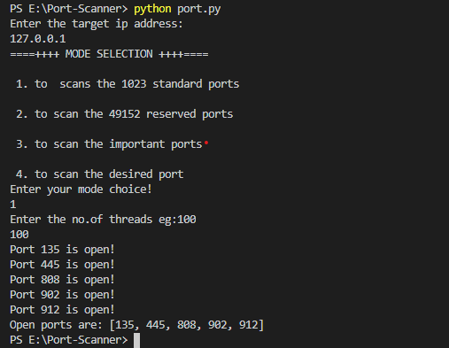

## Port scanner
    This is a simple port scanner project used to scan the ports opened in an IP or a network.

# Dependencies <br>
    Threading - Allows to perform multi task
    socket-sokect programming helps to connect two nodes on network to commuunicate with each other
    
# To Run

```
git clone https://github.com/The-ARK-Technologies/Port-Scanner
cd Port-Scanner
bash port.py

```


# Demo image


     
## Contributions are welcome !

<p>

</p>
